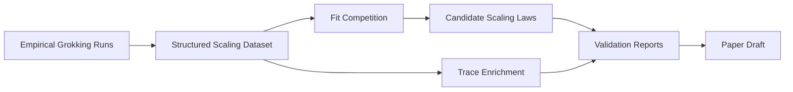

# Grokking Scaling Theory

Empirical ML research package for testing scaling-law and effective-theory claims around grokking.

## Summary

Grokking Scaling Theory is a research package for studying delayed generalization in modular-arithmetic learning dynamics. It focuses on structured scaling datasets, fit competition across candidate asymptotic laws, RG-inspired effective models, and trace enrichment for grokking experiments. The project is strongest as an empirical research artifact: it turns an ambitious theoretical idea into datasets, scripts, reports, and falsifiable claim boundaries.

## What It Demonstrates

- Empirical ML research workflow with structured datasets and analysis scripts.
- Fit competition across candidate scaling laws rather than a single hand-picked curve.
- Scientific caution: negative and boundary-setting results are included as evidence.
- Technical writing that distinguishes promising mechanisms from universal claims.

## Architecture

The package centers on a small Python research surface: dataset loaders, model comparison utilities, corrected scaling-law evaluation, RG-inspired flow models, and trace-enrichment helpers. Reports and manuscript assets live alongside the code.



## Phase 2: Categorical Order Parameters (2026-07)

A complete, pre-registered follow-on study asking whether categorical
structure — a label-free sheaf/kNN "gluing" parameter (geometric leg) and a
Logical-Information-Cells decidability parameter (logical leg) — supplies
the architecture-universal order parameter for grokking that phase 1
lacked. 63 deterministic training runs across five architectures, seven
dated protocol amendments, and gate-validated instruments.

**Headline result:** grokked modular arithmetic is a *churning,
strengthening wave code* at every trainable depth and width. The sheaf
parameter beats the variance incumbent everywhere but leads grokking by
10-25% — becoming coincident only at narrow width; no logical cell ever
assembles (units churn, newcomers are always born sinusoidal); depth
*amplifies* the Fourier code (concentration 0.47 -> 0.54 -> 0.72 across
1 -> 3 -> 5 ReLUs) instead of extinguishing it, while trainability
collapses; width, not depth, is the dominant quantization pressure.

- Paper draft: [`paper/WAVE_CODE_PAPER.md`](paper/WAVE_CODE_PAPER.md)
- Canonical results (18 findings): [`analysis/ORDER_PARAMETER_RESULTS.md`](analysis/ORDER_PARAMETER_RESULTS.md)
- Pre-registration + amendments: [`experiments/PHASE2_CATEGORICAL_ORDER_PARAMETERS.md`](experiments/PHASE2_CATEGORICAL_ORDER_PARAMETERS.md)
- Instruments: `src/grokking_scaling_theory/{sheaf_order_parameter,logical_cells,sharpening,order_parameter_compare}.py`
- Reproducibility: training is bit-deterministic from the seeds in
  `data/phase2_traces_v2/phase2_run_table.csv` (verified 18/18);
  per-example traces (~29 GB) are not committed but regenerate exactly via
  `scripts/train_grokking_traces.py`.

## Installation

```bash
pip install -e .
```

## Usage

```python
from grokking_scaling_theory.corrected_scaling_law import (
    CorrectedScalingLaw,
    load_default_dataset,
)
from grokking_scaling_theory.fit_competition import compare_models

dataset = load_default_dataset()
results = compare_models(dataset)
law = CorrectedScalingLaw(k=1.5, beta=0.65)
evaluation = law.evaluate(dataset)
```

## Evidence

- Expanded validation used 21 scaling points, including 19 measured points.
- Pooled fits were intentionally harsh, testing whether one shared exponent pair survives a mixed dataset.
- Published MLP anchors behaved differently from local MLP and residual ladders, pointing toward regime dependence rather than naive universality.
- Reports explicitly separate promising latent-variable theory from unsupported universal claims.

## Known Limitations

- This does not claim a solved theory of grokking.
- Current evidence does not establish architecture-independent universality.
- Some anchors and bibliography assets are still research-stage.
- Additional measured runs, tests, and manuscript cleanup are needed before treating this as publication-ready.

## Status

Research artifact / empirical ML systems project.

