# TOK: A Governed Epistemic Architecture for Mechanism-Centered AI Reasoning

TOK is a research software system for turning messy situations into auditable
mechanism hypotheses, dynamic traces, reviewed observations, and human-gated
evidence-transition proposals.

The central discipline is simple: candidates are not truth, observations are
not automatically evidence, and simulations do not authorize autonomous
intervention.

This repository is a public research artifact package prepared from a larger
TOK workspace. It includes sanitized freeze summaries, replay artifacts,
validation checks, and a minimal toy reference pipeline. It is not a mirror of
the full internal research engine, and it intentionally excludes private
benchmark answer keys, private maps, private scorecards, and production update
paths.

## Overview

Many AI systems collapse narrative situations into confident labels, causal
claims, or recommendations too quickly. TOK instead represents reasoning as a
sequence of validated artifacts:

- mechanism graphs,
- dynamics-template bindings,
- dynamic divergence traces,
- observation registries,
- evidence-transition proposals,
- causal-status assessments,
- error atlases,
- freeze manifests.

Each artifact carries explicit boundaries such as `production_effect:
none_research_only`, `candidate_not_evidence`, `may_update_evidence: false`,
and `may_update_wisdom_db: false`.

## Why It Matters

The project is not trying to make an AI system "discover truth" by itself. It
is building a governed workflow where model-assisted reasoning can be inspected,
replayed, audited, and stopped before it crosses from hypothesis into evidence.

That makes TOK useful as a portfolio artifact because it shows systems thinking
across software architecture, benchmark hygiene, simulation methodology, and
AI-safety boundaries.

## System Architecture

```mermaid
flowchart LR
  A["Narrated situation"] --> B["Source-bounded mechanism graph"]
  B --> C["Candidate dynamics binding"]
  C --> D["Dynamic divergence trace"]
  D --> E["Reviewed observation registry"]
  E --> F["Evidence-transition proposal"]
  F --> G["Human review gate"]
  G --> H["Causal-status assessment"]

  F -. "may_update_evidence: false" .-> I["No autonomous production update"]
  H -. "production_effect: none_research_only" .-> I
```



## Research Benchmarks

Paper 1 and Paper 3 use a naturalistic causal-coordinate benchmark and Error
Atlas process to study boundary hygiene in synthetic causal-coordinate tasks.

Included public-facing summary:

- naturalistic holdout: 240 problems;
- exact coordinate accuracy: `173/240 = 0.7208`;
- axis decision accuracy: `885/960 = 0.9219`;
- reviewed Error Atlas: 67 rows, 20 transition clusters, 6 review batches;
- boundary-note mini-holdout: 83 problems;
- mini-holdout exact coordinate accuracy: `69/83 = 0.8313`;
- mini-holdout axis decision accuracy: `315/332 = 0.9488`;
- replacement lane: `39/39 = 1.0000`.

Private benchmark answer keys, private maps, and private scorecards are not
included in this public package.

## Dynamics Atlas

Paper 2 studies structural recoverability under a frozen ordinal ladder:

- 12 systems across 7 regimes;
- 116,640 admissibility fits;
- 144 collapse transects;
- behavioral response-window calibration;
- response assay contract with retained HPC provenance receipt;
- all recorded acceptance gates passed in the freeze manifest.

This supports claims about the tested implementations, corpus, ladder, and
measurement grid. It does not support broad invalidation of LTC/LNN model
classes or empirical causal validity.

## Demo Freeze / Research Cockpit

Demo Freeze v0 is a deterministic local replay for a research cockpit:

```text
source graph
-> candidate binding inspection
-> prior DYNDIV
-> reviewed CSV observations
-> seen-data registry
-> evidence-transition proposal
-> causal-status and boundary-breach artifacts
-> loose observation triage
-> triage-to-causal bridge
-> dynamic signal scout
-> data-driven workbench candidate
-> read-only cockpit trace
```

Key public replay artifacts:

- `research/demo_freeze_v0/generated/demo_public_summary_v0.json`
- `research/demo_freeze_v0/generated/demo_session/reports/cockpit_trace_v0.json`
- `research/demo_freeze_v0/generated/demo_session/reports/demo_replay_report_v0.json`

## Safety And Epistemic Boundaries

TOK is deliberately conservative:

- candidates are not evidence;
- observations are registered as seen data, not truth;
- evidence proposals are not applied automatically;
- simulations are research-only;
- private benchmark workspaces are not public demo material;
- no artifact in this package updates production memory or `wisdom_db`.

## Technical Stack

- Python research spine with deterministic local smoke checks.
- JSON artifact contracts and manifest hashing.
- CLI-first research cockpit replay.
- Dynamic systems benchmarks and recoverability/collapse atlases.
- Optional frontend work exists in the larger workspace, but the frozen public
  package is centered on the research spine and replay artifacts.

## Selected Artifacts

See [docs/SELECTED_ARTIFACTS.md](docs/SELECTED_ARTIFACTS.md) for a compact
map of the public-safe artifacts in this repository.

See [docs/PUBLIC_SCOPE.md](docs/PUBLIC_SCOPE.md) for the exact public release
scope: what is included, what is intentionally excluded, and what claims this
package does not support.

## Minimal Reference Pipeline

The public package includes a small executable toy pipeline:

```powershell
python examples\toy_reference_pipeline\run_toy_reference_pipeline.py --write
```

The toy pipeline is not the private TOK engine. It is a compact reference
example showing the artifact discipline: a narrated situation becomes a
candidate mechanism graph, candidate dynamics binding, dynamic divergence
trace, reviewed observation registry, evidence-transition proposal, and
causal-status assessment while preserving `candidate_not_evidence`,
`may_update_evidence: false`, and `production_effect: none_research_only`.

## Validation

The full internal workspace validation command is:

```powershell
.venv\Scripts\python.exe -B tools\run_tok_smoke_suite.py
```

In the source workspace, this passed 26 safe research checks on 2026-06-18.
This public package also includes a narrower validation command that checks
public release boundaries and freeze summaries:

```powershell
python tools\validate_public_tok_package.py
```

The public validator also checks the toy reference pipeline and confirms that
the example does not apply evidence updates or production updates.

## Current Status

TOK is a research system with three important freeze packages:

- Paper 1 benchmark freeze: sanitized public summary included.
- Paper 2 dynamics atlas freeze: sanitized public summary included.
- Demo Freeze v0 cockpit replay: sanitized public summary and session artifacts included.

Next work should focus on hardening the research cockpit UI and preparing paper
drafts around narrow, citable claims rather than expanding the ontology.
